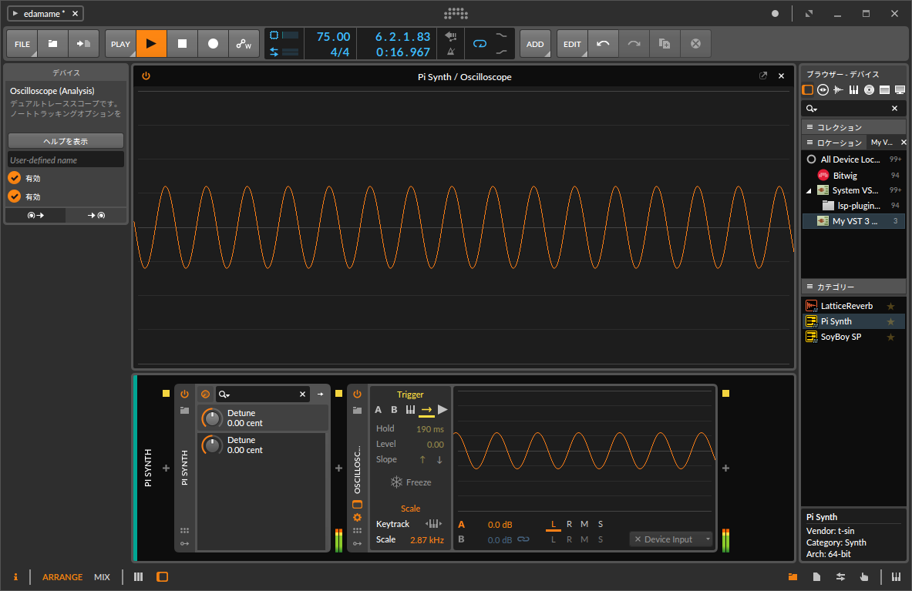

# Pi - VST3 plug-in example in Rust

A simple sine synth written in Rust. This repository folked from [SoyBoy SP](https://github.com/t-sin/soyboy-sp.vst3).

## Author

- Shinichi Tanaka (<shinichi.tanaka45@gmail.com>)

## License

This project is lisenced under the GPLv3 because of [Steinberg's licensing poricy](https://developer.steinberg.help/display/VST/VST+3+Licensing).
